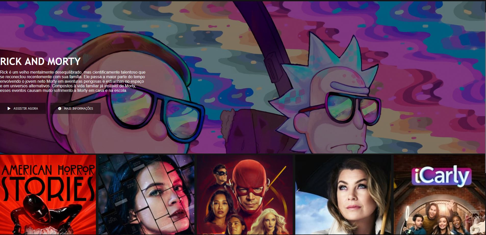

Olá, tudo bem? :hand:

este é um projeto de um clone da pagina de principal do Netflix, desenvolvida durante o bootcamp _"HTML Web Developer"_.

foram trabalhados conceitos de responsividade, e utilizado uma biblioteca jQuery para manipulação do carrossel de séries.

<u>Acima representação do site vista de um Desktop.</u>
